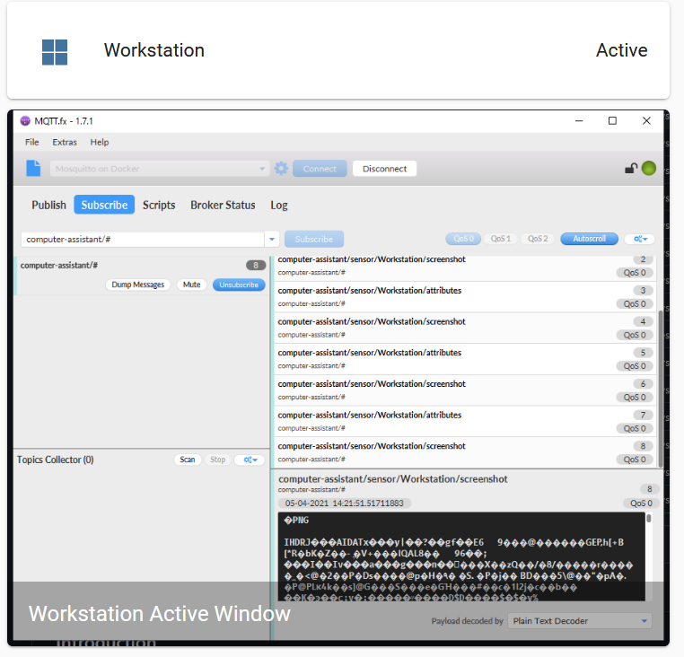

# Computer Assistant   

## Introduction

This project integrates into  automatically using **MQTT Discovery** to provide an entity to show whether your computer (Windows only) is Online, Active or Offline.
You can add an **MQTT Camera** entity by updating your _config.yaml_ file, so that the currently active window is displayed in your Lovelace UI.
Commands can be published via MQTT to retrieve a current snapshot of the active window or to send a notification that will pop up using the Windows Notification system.

---

  

## Installation

## Configuration

## How to Use

## Support

## Roadmap

## Author

## License
