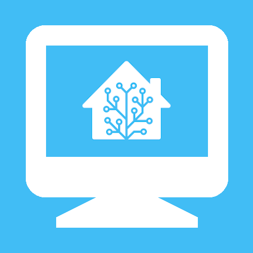
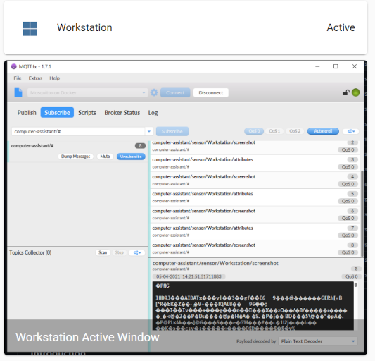
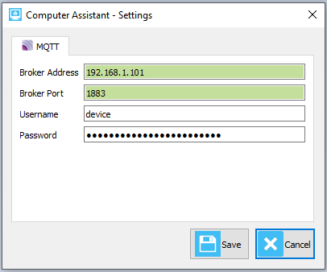
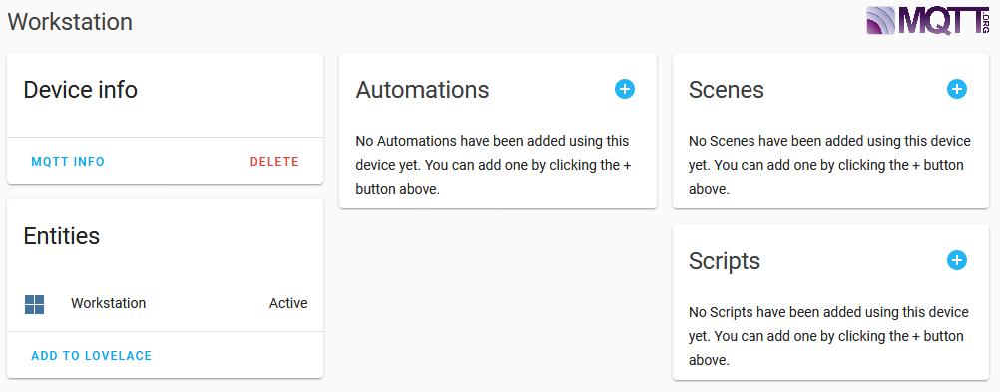
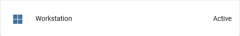
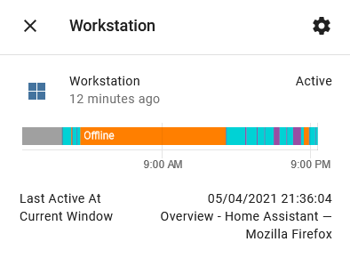
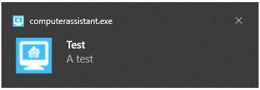
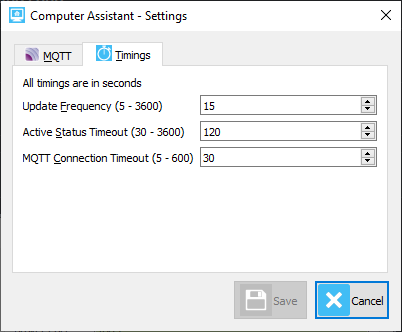

# Computer Assistant   

<p align=center>

<p>

## Introduction

This project integrates into [](https://www.home-assistant.io/) automagically using **MQTT Discovery** to provide an entity to show whether your computer (**_Windows only_**) is Offline, Online or Active.  
You can add a **MQTT Camera** entity by updating your _configuration.yaml_ file, so the currently active window is displayed in your Lovelace UI.  
Commands can be published via MQTT to retrieve a current snapshot of the active window or to send a notification that will pop up using the Windows Notification system.

<p align=center>

<p>

## Installation

The simplest method to get started is to copy computerassistant.exe from [releases](https://github.com/malcolmcdixon/computerassistant/releases) to any folder.  
**Suggestion**: add a shortcut to computerassistant.exe in the startup folder.

Alternatively, [clone or download](https://docs.github.com/en/github/getting-started-with-github/getting-changes-from-a-remote-repository#cloning-a-repository) the source code, preferably into a [virtual environment](https://docs.python.org/3/library/venv.html) and run  
`$ pip install -r requirements.txt`

## Configuration

Ensure you have the [MQTT Integration](https://www.home-assistant.io/integrations/mqtt) added in Home Assistant.

Launch computerassistant.exe or if running from source code enter:  
`$ python ca.py`

The program will appear in the notification area 

Select the  menu item from the context menu and enter your MQTT server details and credentials in the form.



The _broker address_ **must** be a valid ip address, the text input control's background will be green when valid else red if invalid.

The _broker port_ defaults to 1883, change this to the port your MQTT broker uses (valid values 1024 to 65535).

Enter the _username_ and _password_ to connect to your broker.

**NOTE:** _The project has only been tested using port 1883 and with a username and password._

When Computer Assistant connects to the MQTT broker it will publish a config message on topic _homeassistant/sensor/computer-assistant/{your-computer-name}/config_, this will create the device automagically in Home Assistant.

<p align=center>

<p>

Add the device to Lovelace.

### Add a MQTT Camera

Follow the [MQTT Camera](https://www.home-assistant.io/integrations/camera.mqtt/) instructions to configure the _virtual_ camera in your _configuration.yaml_.  
**Example**

```yaml
camera:
  - platform: mqtt
    topic: computer-assistant/sensor/Workstation/screenshot
    name: Workstation Active Window
    unique_id: Workstation
```

**NOTE:** Replace _Workstation_ with your computer's name.  
This will create a camera entity that you can then add to Lovelace.

## How to Use

### Sensor

In Lovelace UI select the Computer Assistant Sensor.



This will show the sensor details.



You can see the history of when the computer was offline, online and active.  
The last active time is displayed and the currently active window if applicable.

### Camera

Selecting the camera is just like any other camera feed, it will display a larger image in its own window.

### Commands

There are only 2 commands, screenshot and notify, to use these publish a message via MQTT.

#### Screenshot

The screenshot command will instruct Computer Assistant to send an updated image of the active window.  
topic:  
_computer-assistant/sensor/{your-computer-name}/cmd/screenshot_

#### Notify

The notify command will create a notification in the Windows Notification
topic:  
_computer-assistant/sensor/{your-computer-name}/cmd/notify_  
payload:

```json
{ "title": "Test", "message": "A test" }
```



### Other Settings

To adjust the various timings in Computer Assistant, select the Timings tab in the Settings dialog.



**Update Frequency**  
Controls the interval time the program will check for activity and publish MQTT messages. Default 15 seconds.

**Active Status Timeout**  
Controls how long before the program determines that the computer is no longer active if no mouse or keyboard events are detected. Default 120 seconds.

**MQTT Connection Timeout**  
Controls how long before the program determines that a connection attempt to a MQTT broker has timed out. Default 30 seconds.

## Roadmap

This project was initiated mainly as a programming exercise to test my recently gained knowledge of Python, to learn Qt and to send notifications to my computer from Home Assistant automations in Node-Red.

This is my first public repository on Github, the code is far from perfect but works!

I don't have any particular plans for developing other features other than automating the MQTT Camera configuration, but I'd like to have it work on Linux too. However, if there's a particular killer feature you'd like then complete a [feature request](https://github.com/malcolmcdixon/computerassistant/issues/new?template=feature_request.md).

## Support

I will try to help anyone having issues installing, configuring and using Computer Assistant where possible.
To obtain support please complete a [bug report](https://github.com/malcolmcdixon/computerassistant/issues/new?template=bug_report.md).
