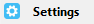

# Computer Assistant   

  

## Introduction

This project integrates into  automatically using **MQTT Discovery** to provide an entity to show whether your computer (\*\*\_Windows only**\*) is Online, Active or Offline.  
You can add an **MQTT Camera\*\* entity by updating your \_config.yaml\* file, so the currently active window is displayed in your Lovelace UI.  
Commands can be published via MQTT to retrieve a current snapshot of the active window or to send a notification that will pop up using the Windows Notification system.

  

## Installation

The simplest method to get started is to copy computerassistant.exe from [releases](https://github.com/malcolmcdixon/computerassistant/releases) to any folder.  
**Suggestion**: add to the startup folder.

Alternatively, [clone or download](https://docs.github.com/en/github/getting-started-with-github/getting-changes-from-a-remote-repository#cloning-a-repository) the source code, preferably into a [virtual environment](https://docs.python.org/3/library/venv.html) and run  
`$ pip install -r requirements.txt`

## Configuration

Ensure you have the [MQTT Integration](https://www.home-assistant.io/integrations/mqtt) added in Home Assistant.  
Launch computerassistant.exe or if running from source code
`$ python ca.py`

The program will appear in the notification area 

Select the  menu item from the context menu and enter your MQTT server details and credentials in the form.

The _broker address_ **must** be a valid ip address, the text input control's background will be green when valid else red if invalid.

The _broker port_ defaults to 1883, change this to the port your MQTT broker uses (valid values 1024 to 65535).

Enter the _username_ and _password_ to connect to your broker.

**NOTE:** _The project has only been tested using port 1883 and with a username and password._

When Computer Assistant connects to the MQTT broker it will publish a config message on topic _homeassistant/sensor/computer-assistant/{your-computer-name}/config_, this will create the device automagically in Home Assistant.

## How to Use

## Support

## Roadmap

## Author

## License
